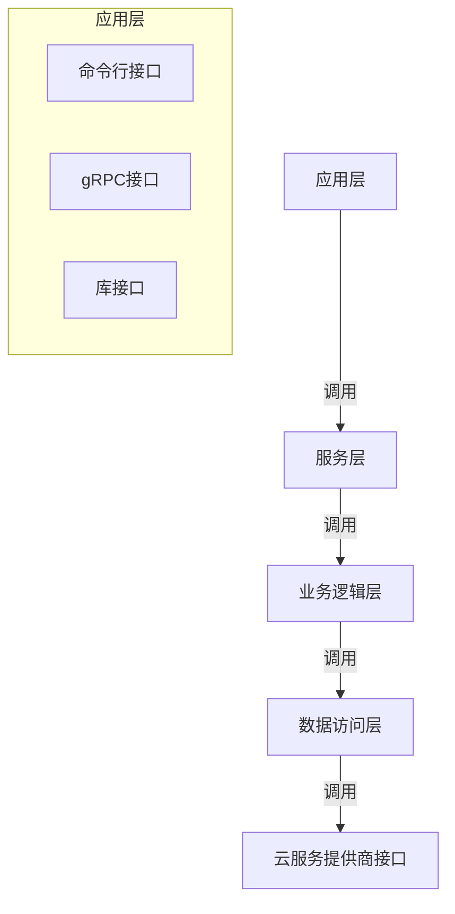
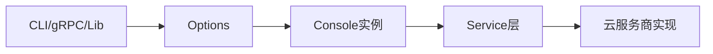

# Design

## 功能

- 调用云服务凭据扮演角色登录控制台
- 支持腾讯云、阿里云、aws等云服务提供商
- 程序支持命令行模式、grpc微服务模式、lib库模式
- 配置支持环境变量方式和配置文件的方式
- 记录云API调用链，按时间序列，基于云审计日志分析防御

## 架构

### 分层架构

```mermaid
graph TD
    A[应用层] -->|调用| B[服务层]
    B -->|调用| C[业务逻辑层]
    C -->|调用| D[数据访问层]
    D -->|调用| E[云服务提供商接口]
    
    subgraph 应用层
        F[命令行接口]
        G[gRPC接口]
        H[库接口]
    end
```

具体实现

```mermaid
graph LR
    A[CLI/gRPC/Lib] --> B[Options]
    B --> C[Console实例]
    C --> D[Service层]
    D --> E[云服务商实现]
```
